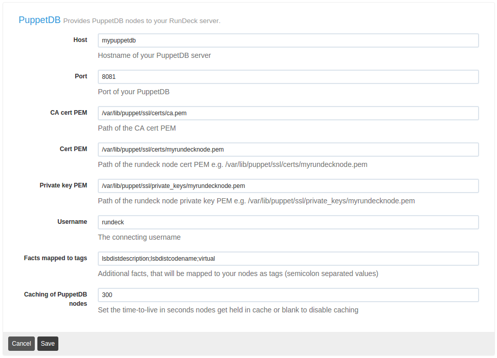

# Rundeck PuppetDB Nodes Plugin

[](https://travis-ci.org/synyx/rundeck-puppetdb-nodes-plugin)
[ ](https://bintray.com/synyx/rundeck-plugins/rundeck-puppetdb-nodes-plugin/_latestVersion)

This is a [Resource Model Source plugin](http://rundeck.org/docs/developer/resource-model-source-plugin.html)
for [RunDeck](http://rundeck.org) 2.5+ that provides PuppetDB nodes for your
Rundeck server.


## Build

```bash
gradle build
```


## Installation

Copy the `rundeck-puppetdb-nodes-plugin-XXX.jar` file to the `libext/` directory
inside your Rundeck installation.


## Configuration

Note: The client authentication to PuppetDB is done via SSL certificates. So Rundeck
requires read permission to the puppet managed SSL certificate.

You can configure the node source via the webinterface




or via `project.properties`:

```
resources.source.1.type=puppetdb
resources.source.1.config.ca_cert_pem=/var/lib/puppet/ssl/certs/ca.pem
resources.source.1.config.cache=300
resources.source.1.config.cert_pem=/var/lib/puppet/ssl/certs/myrundeckhost.pem
resources.source.1.config.facts=lsbdistdescription;lsbdistcodename;virtual
resources.source.1.config.private_key_pem=/var/lib/puppet/ssl/private_keys/myrundeckhost.pem
resources.source.1.config.puppetdb_host=mypuppetdb
resources.source.1.config.puppetdb_port=8081
resources.source.1.config.username=rundeck
```

For more details about node sources refer to the official [Rundeck / Administrator Guide / Managing Node Sources](http://rundeck.org/docs/administration/managing-node-sources.html)


## Authors

* Johannes Graf


## License

rundeck-puppetdb-nodes-plugin is released under the MIT License. See the bundled
[license file](LICENSE) for details.

